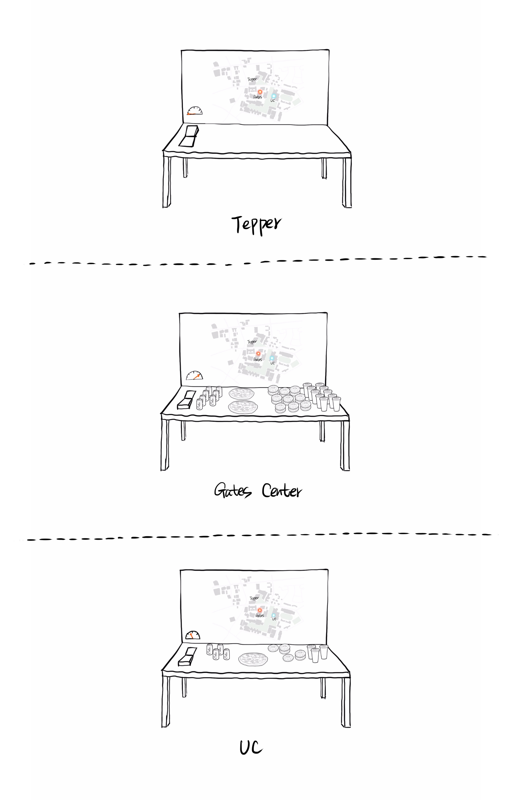
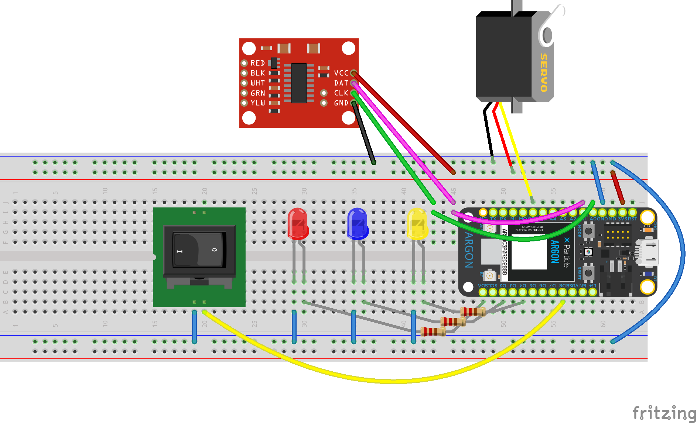

# IoT-Community-Food-Re-distribution

## Introductions
Our prompt for this project is to create something that can contribute something to the community of people. We eventually created a food re-distribution system by connecting community food tables to the cloud. We wanted to reduce the avoidable food waste people create every day by re-distributing food within the community. With the help of food, we can bring people in the community together and create their interaction. 

## Contributors
Ariel Yu, Hongxun Jin, Tiancheng Yang and Susan Xu

## Intention
According to the US Department of Energy, there are 61.2 million tons of food waste across the United States every year, an amount that can feed 112 million people for one year. What's worse, among all the amount of food wasted, 60 million tons is avoidable, the amount that accounted for 29% of the overall annual production. Because of the development of society, food wastage has become a more and more severe issue, the overall food waste has increased by 50% during the past 45 years. With the increased accessibility to abundant resources, people tend to over-acquire and fail to consume the resources.
Within companies and governmental or educational institutes, people order food for all kinds of events and meetings. We observed that in order to minimize the risk of not getting enough food for everyone, event/meeting organizers often over-order food. In addition, especially within campuses, a lot of people are not showing up for the events they registered for, leading to the overestimated number of people for events. These phenomena happening every day and everywhere are causing a huge amount of avoidable food waste. As a result, in order to truly avoid these food waste, our project combined the IoT technology to aim at the realization of re-distributing excess food resources within communities. 

## About the Community Chosen
Our eventual goal of the project is to re-distribute food within the community of generation. For example, over-ordered food from a meeting of one department of a company should be resolved within the company (multiple departments and colleagues). In this particular project, we started from the community of Carnegie Mellon University Pittsburgh (short as CMU) Campus. CMU is an educational institute with nearly 15,000 students and 1,400 faculties. Within the campus, there are academic, career-oriented, leisure, extracurricular, cultural, etc. events/meetings going on every day, and nearly every event provides snacks or meals. Our team members, as CMU students, observed a considerable amount of excess food thrown away or left randomly somewhere after events. Meanwhile, students in CMU are always hungry and fond of food or snacks. Hence, within the CMU community, we foresaw a balance between supply and demand for the over-ordered food. And thus, we decided to start our project in the community.

## Inspiration and Context
Similar ideas have been explored by multiple groups including MIT media lab and some CMU departments. 

- Over-ordered pizzas left in the computer lab: This is our main inspiration. One day working late in the computer lab of Gates Computer Science, I discovered three boxes of complete pizza left on the common desk of the lab without being noticed by the many students who were also burning the midnight oil in the nearby area. Eventually, the pizzas became a significant amount of food waste being thrown away. That inspired me to think about how to consume the excess food within the community, for just a few steps away from the "potential food waste" there were students eating midnight snacks. We have people who need food and we have extra-ordered food within the same community, so consuming the food waste within the community seems one step away. 

- Food table in common area: Currently, in the CMU community, there are regular tables in common areas that people randomly put over-ordered food from meetings or events for students passing by.

- Harvard University student project of food waste: A few years ago in Havard University, students there did a project about food re-distribution. They connected a food table to the cloud to send twits when there is food on it so that followers of the twitter account will be notified when there is food on the table. 

With these inpiration in mind, we want to take a step further. There are dedicated tables for leftover foods on the CMU campus, but they have shortcomings in two ways: First, people don't know if there is food there, or if the food is still there. Second, they are isolated and not easily accessible. In this project, we want to build a system of connected leftover food tables to connect all of them together. 

## Process
We researched the CMU community through observation and brief interviews, we know that there are over-order food and people seeking for snacks. Also, since people are all from the same community, they feel good about communicating with each other if there are conversation starters. Hence, under the operation of our project, we can connect people in the CMU community to re-distribute food and to build networking. With the goals in mind, we ideate the part of implementation with the combination of IoT technology. Initially, we had the basic concept in mind that we will be building a system that helps re-distribute excess food resources. The technic is quite simple: on the selected spots on campus (usually located within the hall of each department building), there is a food station (a table for food placing), a food switch on the button (for people with excess food to notify people in the community), and a map with light bulbs that indicates the availability status of food at each food station.

However, after further researches and understanding of the community, we found out that most people are not aware of the severity of food waste generated and do not feel they can be part of this issue. As a result, we eventually decided to go one step further to add an educational layer to our project. We want to raise awareness of the severe food waste problem but also to convey the idea that by a few steps of efforts, everyone can deliver significant contributions to the issue. To realize this, we added a food waste meter to the food station to show the "potential" food waste amount and the deduction of the food waste when it is re-distributed and taken away by people from the community. The technic of this part is to add a load cell to the food station to provide input data of the food waste weight and connect it to the food meter so that the increase and decrease of food can be visualized.  

## Conceptual Design 
At the end of the day, there are three expected goals to be achieved in this project. Firstly, to raise awareness of the food waste issue, how much food waste is generated among the community, and how everyone in the community can go one step further to make changes and prevent the excess food actually to become waste. Secondly, to encourage people to communicate with others. We expected this project to be a good conversation starter because we know that food is always a good thing for people to start the conversation. Last but not least, to create the connection among the dots of the community to make relationships closer. Currently, departments in CMU are mostly isolated without too many interactions. We expect this project to bring all the departments and institutes together to the network of the whole community.  

In this stage of the project, we selected three spots on the CMU campus to implement our food stations. Each table was installed with a load cell amplifier and meter to indicate the amount of available food, and a noticeable food switch ("food here" on one side, "I took the last one" on the other side) is designed to show the availability. The map with inserted LEDs was put on the panel to display the availability in different spots on the campus.

## Prototype
Food Station- With a load cell attached to the bottom, the food station is the input of the IoT system. It can not only act as a location where people re-distribute excess food but also measure the weight of the "potential" food waste so that people can visually see how much surplus food is generated and can be avoided. 

Food Switch- The input of the IoT system. A switch located on the food station which is connected to the cloud with Particle Argon. When the switch is turned on, as an indicator of food available, it signals to light up the light bulbs on the food map. Each switch at a location is connected to the light bulbs on a specific site, representing the food availability of that location. 

Food Waste Meter- The output of the IoT system. Connected to the load cell, the meter shows the load of the food on the food station, visualizing the increase and decrease of the food resource to highlight the issue of food waste as well as the contribution of individuals. 

Food Map- With several light bulbs pinned to the selected spots with the food station, the food map is the output of the IoT system. Connected to the food switch, the light bulbs turn on and off according to the signal sent by the switch ("food here" to on and "I took the last piece" to off). This output plays the role of providing and spreading information about food availability to people within the community. 

BOM:
- Toggle switch *3
- Particle Argon *3
- LED *9
- 1K*9
- Load cell *3
- Micro servo *3

To sum up, we used 3 Particle Argons for the 3 sites of selection on campus (Tepper Business School, Gates Computer Science Department, and Cohon University Center). Each Particle Argon connected 3 light bulbs(representing 3 locations), 1 micro servo(to control the meter), 1 load cell(to measure the weight of food), and 1 toggle switch(receive signals from people providing and taking the last portion of food). 

## Next Steps
During the current stage of prototyping, demonstrating, and feedbacks, we concluded the followings as our next steps:
1. Technically, the inputs we got from the load cell are quite noisy. During the demonstrating process, we had trouble to keep the output of the load cell, the food meter, stable, leading to several confusions. 
2. When we are expanding the scale of food re-distribution into the whole community, we need to take into consideration of the food safety problem. To ensure the hygiene and safety of re-distributed food, we might need to corporate with the cleansing staff of the community to guarantee the freshness of food and install monitor cameras along with the system to avoid food toxins. 
3. Improve the fidelity of our project to make it more engaging and eye-catching. 
4. Eventually, we would like to combine this technology with deep learning. Our goal is to alter the input data from switch signals to instant images of the food on the table. After the recognition of food on the table, the system will automatically send out signals to the output bulbs on the food maps. This will avoid confusion or errors and can also be combined with food safety monitoring. 
